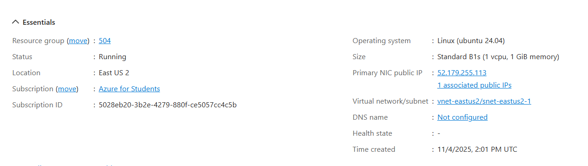
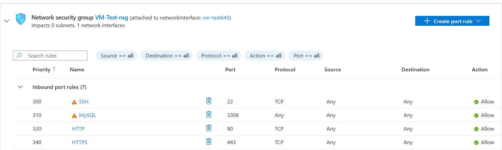
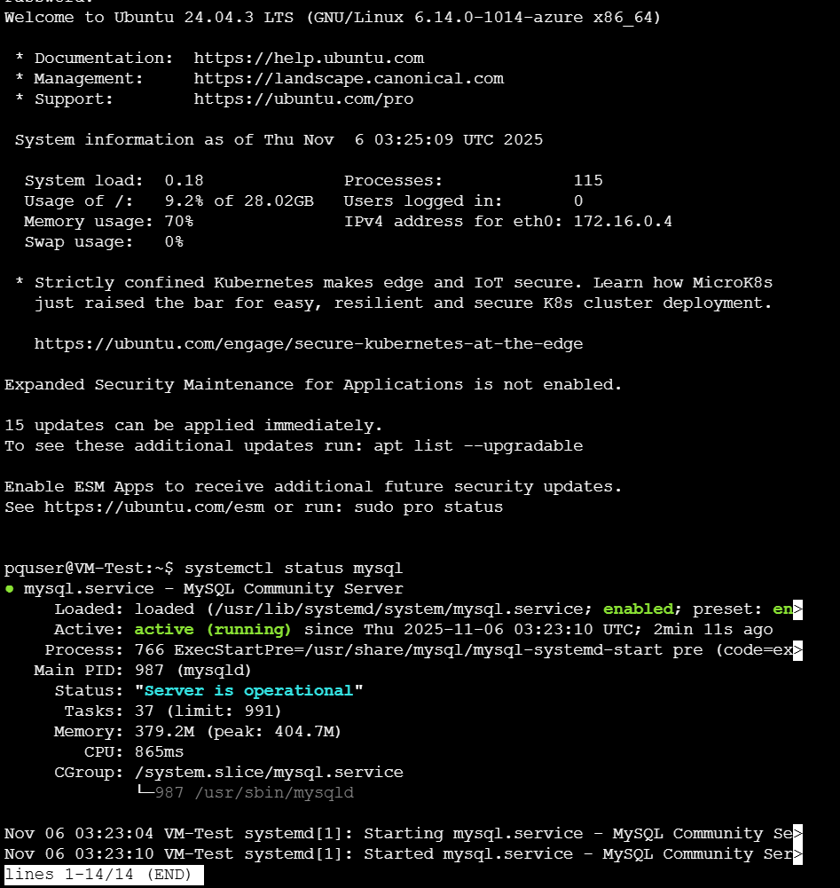
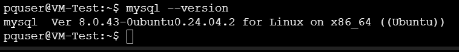
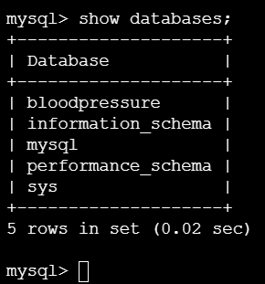
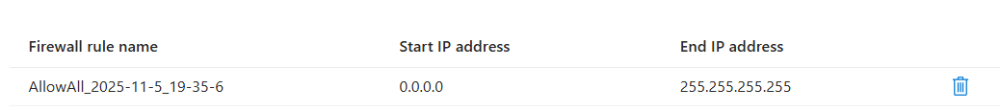
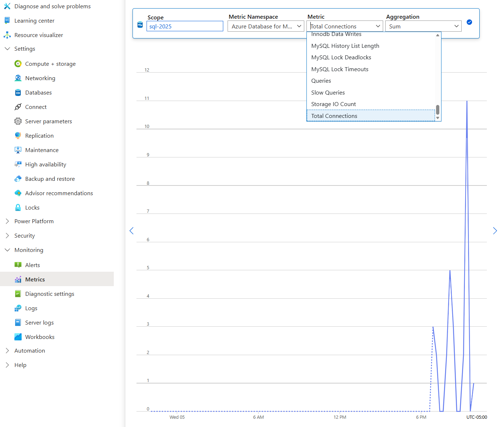
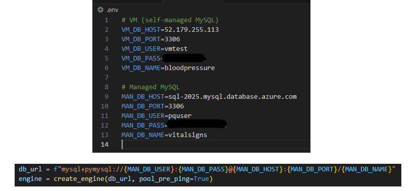
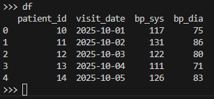

# Project Setup: Azure MySQL + VM Deployment

## Cloud Provider and Regions

- **Provider:** Microsoft Azure  
- **Resources Deployed:**
  - **Azure Database for MySQL (Flexible Server)** — Region: `West US 3`
  - **Azure Virtual Machine (Ubuntu 22.04)** — Region: `East US 2`

---

## Python + MySQL Integration on Azure

This guide outlines two deployment paths for connecting Python scripts to MySQL databases hosted on Azure.

### Option 1: Azure-Managed MySQL (Flexible Server)

#### Setup Steps

- Provision MySQL Flexible Server in `West US 3`
- Configure:
  - Admin credentials
  - Firewall rules to allow your IP
  - Disable SSL enforcement
- Create a `.env` file with credentials
- Load environment variables in Python
- Connect using SQLAlchemy
- Log and verify query output

---

### Option 2: Self-Hosted MySQL on Azure VM

#### Setup Steps

- Deploy Ubuntu VM in `East US 2`
- Install MySQL Server
- Create database and user
- Enable external access:
  ```ini
  bind-address = 0.0.0.0
  ```
- Open port `3306` in the VM’s network security group
- Install Python and required packages
- Use `.env` for credentials and connect locally
- Load environment variables in Python
- Connect using SQLAlchemy
- Run scripts and verify output

---

## Connection String Pattern

```python
# PyMySQL connection string
DATABASE_URL = (
    f"mysql+pymysql://{MAN_DB_USER}:{MAN_DB_PASS}@{MAN_DB_HOST}:{MAN_DB_PORT}/{MAN_DB_NAME}"
)
engine = create_engine(DATABASE_URL, pool_pre_ping=True)
```

---

## Secrets Management

- Store credentials in a `.env` file (excluded from Git)
- Load using `dotenv.load_dotenv()` in Python

### Example `.env` Structure

```bash
# VM (Self-Hosted MySQL)
VM_DB_HOST=10.0.1.10
VM_DB_PORT=3306
VM_DB_USER=class_user
VM_DB_PASS=change_me
VM_DB_NAME=class_db_netid

# Managed MySQL
MAN_DB_HOST=your-managed-endpoint
MAN_DB_PORT=3306
MAN_DB_USER=class_user
MAN_DB_PASS=change_me
MAN_DB_NAME=class_db_netid
```

---

## Screenshot Summary

### VM Path (Self-Hosted MySQL)

| Step | Screenshot | Description |
|------|------------|-------------|
| 1 |  | VM deployment summary with region, OS, and public IP |
| 2 |  | NSG showing port 3306 open for MySQL |
| 3 |  | `systemctl status mysql` output |
| 4 |  | `mysql --version` output |
| 5 |  | `SHOW DATABASES;` output in MySQL CLI |

---

### Managed Path (Azure-Managed MySQL)

| Step | Screenshot | Description |
|------|------------|-------------|
| 1 |  | Flexible Server setup summary |
| 2 |  | Firewall rules for allowed IPs |
| 3 |  | Query editor or metrics page showing success |

---

### Python Script Execution

| Step | Screenshot | Description |
|------|------------|-------------|
| 1 |  | `.env` file and Python script loading |
| 2 |  | Terminal output confirming connection and row count |

---